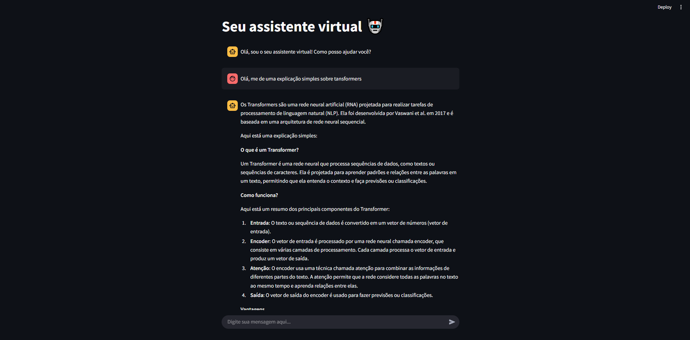
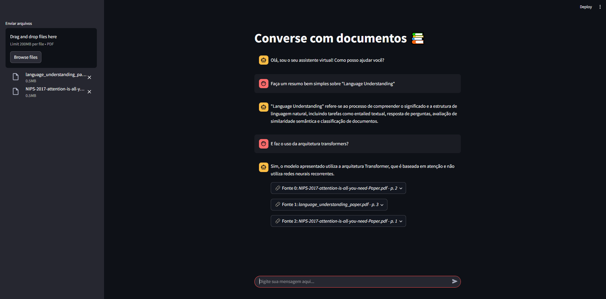

# Chatbots com LLMs, LangChain e RAG

Este repositório contém dois projetos de chatbot desenvolvidos com foco em **LLMs**, **LangChain**, **Hugging Face Transformers** e **Streamlit**, com funcionalidades progressivas:

---

## Projeto 1 — Chat com Memória

**Descrição**:  
Chatbot simples baseado em LLM, com interface em Streamlit e memória de contexto para manter o histórico da conversa.

**Tecnologias utilizadas**:
- LangChain
- Hugging Face Transformers (modelo LLaMA 3)
- Streamlit

**Funcionalidades**:
- Interface web com Streamlit
- Memória de conversação (ContextualChatMemory)
- Respostas contextualizadas com base no histórico da conversa

**Objetivo**:  
Entender o pipeline básico de uma aplicação com LLMs e integração de memória conversacional.

---

## Projeto 2 — Chat com RAG e Upload de PDFs

**Descrição**:  
Evolução do projeto anterior, agora com **RAG (Retrieval-Augmented Generation)** para permitir respostas baseadas em múltiplos documentos enviados pelo usuário.

**Tecnologias adicionais**:
- PyPDF Loader (LangChain)
- FAISS (para vetorizar e indexar os documentos)
- RAG Pipeline com LangChain

**Funcionalidades**:
- Upload de múltiplos arquivos PDF
- Indexação e chunking automático dos documentos
- Geração de respostas com base nas informações extraídas
- Interface interativa com histórico da conversa
- Busca semântica nos embeddings armazenados

**Objetivo**:  
Simular um assistente que responde com base em documentos fornecidos, usando arquitetura RAG.

---

